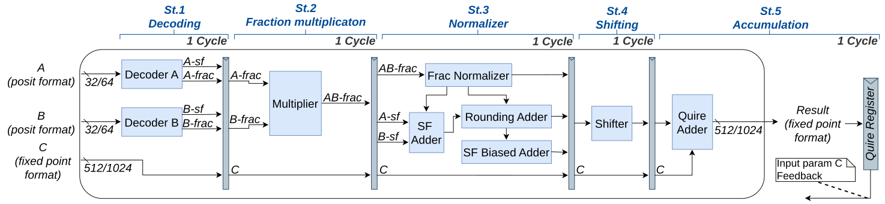
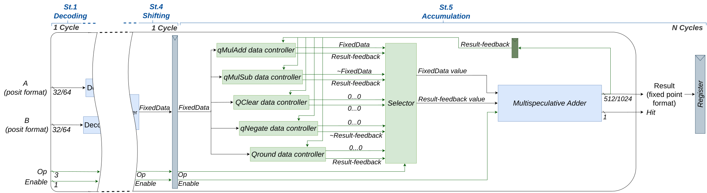

# Multispeculative Posit MAC

This repository contains the source files of 32- and 64-bits Multispeculative Posit Multiply-Accumulative Units, used en the next publication referenced by:

```TEX
In progress
```

## Unit architecture

<figure align="center">
  
  <figcaption><em>Figure 1: Block diagram of the restructured 5-stage pipeline for the proposed Multispeculative PositMAC architecture.</em></figcaption>
</figure>

<figure align="center">
  
  <figcaption><em>Figure 2: Inner architecture of the addition stage for the proposed Multispeculative PositMAC</em></figcaption>
</figure>

## Entry param description

Both units contains the same entry params depicted below:

```VHDL
entity PositMAC64_MS is
    generic (
        MULTIPLY_ALGORITHM_SELECTED         : type_multiplyAlgorithm            := UNKNOWN;
        MULTIPLY_ALGORITHM_ADDER_SELECTED   : type_multiplyAlgorithm_Adder      := UNKNOWN;
        QUIRE_ADDER_ALGORITHM_SELECTED      : type_quireAdder_Algorithm         := UNKNOWN;
        N                                   : integer                           := 1024;
        K                                   : integer                           := 32;
        LOG_K                               : integer                           := 5;
        LOG_N_DIV_K                         : integer                           := 5;
        PIPELINE_STAGE_1                    : std_logic                         := '1';
        PIPELINE_STAGE_2                    : std_logic                         := '1';
        PIPELINE_STAGE_3                    : std_logic                         := '1';
        PIPELINE_STAGE_4                    : std_logic                         := '1'
    );
    port (
        clk             : in std_logic;
        rst             : in std_logic;
        enable          : in std_logic;
        newOp           : in std_logic; 
        A               : in std_logic_vector((POSIT64LEN-1) downto 0);
        B               : in std_logic_vector((POSIT64LEN-1) downto 0);
        QA_OpCode       : in std_logic_vector((OPCODE_LEN-1) downto 0);
        QA_OpTag        : in std_logic_vector((OPTAG_LEN-1) downto 0);
        
        Available       : out std_logic;
        QA_Hit          : out std_logic;
        Ready           : out std_logic;
        Ready_OpCode    : out std_logic_vector((OPCODE_LEN-1) downto 0);
        Ready_OpTag     : out std_logic_vector((OPTAG_LEN-1) downto 0);
        R               : out std_logic_vector((QUIRE64LEN-1) downto 0)
    );
end entity;
```

### Generic Options

- **MULTIPLY_ALGORITHM_SELECTED:** Selects the multiplication algorithm used to multiply the input posit parameters. The supported values are:
  - **VHDL:** Implements the default multiplication algorithm generated by _FloPoCo_ in the baseline design.
  - **MATLIB:** Implements the default multiplication algorithm provided by the VHDL library.
  - **BOOTH_4:** Implements the _Radix-4 Booth_ multiplication algorithm.
  - **BOOTH_8:** Implements the _Radix-8 Booth_ multiplication algorithm.
- **MULTIPLY_ALGORITHM_ADDER_SELECTED:** Selects the internal adder architecture used in the multiplier to sum the generated partial products. This parameter only takes effect when used with the _BOOTH_4_ or _BOOTH_8_ options in _MULTIPLY_ALGORITHM_SELECTED_. The supported values are:
  - **KS:** Implements the _Kogge--Stone_ adder architecture.
  - **BK:** Implements the _Brent--Kung_ adder architecture.
  - **RCA:** Implements the _Ripple Carry_ adder architecture.
- **QUIRE_ADDER_ALGORITHM_SELECTED:** Selects the internal adder architecture used in the multispeculative quire adder, which performs additions on each internal fragment during accumulated operations with the current multiplication result. The supported values are:
  - **KS:** Implements the _Kogge--Stone_ adder architecture.
  - **BK:** Implements the _Brent--Kung_ adder architecture.
  - **RCA:** Implements the _Ripple Carry_ adder architecture.
- **N:** Defines the total length in bits of the quire register (e.g., 1024 bits).
- **K:** Specifies the segment size in bits for the multispeculative quire partition. This parameter must be a power of two ranging from $2$ to $N/2$.
- **LOG_K:** Represents the base-2 logarithm of the segment size $K$ ($\log_2(K)$), used for internal control of the multispeculative adder.
- **LOG_N_DIV_K:** Represents the base-2 logarithm of the total number of segments $N/K$ ($\log_2(N/K)$).
- **PIPELINE_STAGE_1:** Enables (`'1'`) or disables (`'0'`) the insertion of the first pipeline stage registers.
- **PIPELINE_STAGE_2:** Enables (`'1'`) or disables (`'0'`) the insertion of the second pipeline stage registers.
- **PIPELINE_STAGE_3:** Enables (`'1'`) or disables (`'0'`) the insertion of the third pipeline stage registers.
- **PIPELINE_STAGE_4:** Enables (`'1'`) or disables (`'0'`) the insertion of the fourth pipeline stage registers.

### Input Ports

- **clk:** Master system clock signal.
- **rst:** Active-high system reset signal.
- **enable:** Enable signal to control pipeline execution. Must be `1` each time that the components received a new operation.
- **newOp:** High-active control flag indicating the start of a new operation.
- **A:** First input operand represented in 64-bit posit format.
- **B:** Second input operand represented in 64-bit posit format.
- **QA_OpCode:** Operation code vector associated with the incoming operation. The supported values are:
  - **QMADD:** Multiplies the input posit parameters and adds the result to the previously accumulated value in the quire register.
  - **QMSUB:** Multiplies the input posit parameters and subtracts the result from the previously accumulated value in the quire register.
  - **QCLR:** Clears the quire accumulator, resetting all bits of the quire register to zero.
  - **QNEG:** Negates the current accumulated value stored in the quire register.
  - **QROUND:** Starts the speculation phase of the multispeculative quire adder.
- **QA_OpTag:** Unique identifier tag associated with the input instruction for pipelined operation tracking.

### Output ports

- **Available:** Flag signal indicating that the unit is ready to accept a new input operation.
- **QA_Hit:** Signal indicating that the speculation phase has finisehd and the results of the multiplication sequence can be read from the `R` output port.
- **Ready:** Flag signal indicating that the current operation has finished has been completed and the its information can be ride from the `Ready_OpCode` and `Ready_OpTag` params.
- **Ready_OpCode:** Output instruction operation code synchronized with the completed result (`Ready` active). Its supported value are the same that the `QA_OpCode` param.
- **Ready_OpTag:** Output instruction tag synchronized with the completed result (`Ready` active) for matching pipeline responses.
- **R:** Resulting accumulated value exported in fixed-point format.